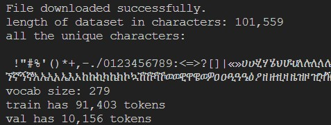

# nanoGPT With Amharic Dataset
I used two Amharic books named `እንስት አንበሶቹ ይነሣሉ` and `ጽናት`  to train the NanoGPT model.

## install

```
pip install torch numpy transformers datasets tiktoken wandb tqdm
```

Dependencies:

- [pytorch](https://pytorch.org) <3
- [numpy](https://numpy.org/install/) <3
-  `transformers` for huggingface transformers <3 (to load GPT-2 checkpoints)
-  `datasets` for huggingface datasets <3 (if you want to download + preprocess OpenWebText)
-  `tiktoken` for OpenAI's fast BPE code <3
-  `wandb` for optional logging <3
-  `tqdm` for progress bars <3

## quick start

First, we download it as a single (2MB) Amharic file and turn it from raw text into one large stream of integers:

```
$ python data/amharic_char/prepare.py
```

This creates a `train.bin` and `val.bin` in that data directory. Now it is time to train your GPT. The size of it very much depends on the computational resources of your system:

**I have a GPU**. Great, we can quickly train a baby GPT with the settings provided in the [config/train_shakespeare_char.py](config/train_amharic_char.py) config file:

```
$ python train.py config/train_amharic_char.py
```

Since I don't have GPU I didn't trained it with the above command.

```
$ python sample.py --out_dir=out-amharic-char
```

This generates a few samples 

**I only have a macbook** (or other cheap computer). No worries, we can still train a GPT but we want to dial things down a notch. I recommend getting the bleeding edge PyTorch nightly ([select it here](https://pytorch.org/get-started/locally/) when installing) as it is currently quite likely to make your code more efficient. But even without it, a simple train run could look as follows:

```
$ python train.py config/train_amharic_char.py --device=cpu --compile=False --eval_iters=20 --log_interval=1 --block_size=64 --batch_size=12 --n_layer=4 --n_head=4 --n_embd=128 --max_iters=2000 --lr_decay_iters=2000 --dropout=0.0
```

Here, since we are running on CPU instead of GPU we must set both `--device=cpu` and also turn off PyTorch 2.0 compile with `--compile=False`. Then when we evaluate we get a bit more noisy but faster estimate (`--eval_iters=20`, down from 200), our context size is only 64 characters instead of 256, and the batch size only 12 examples per iteration, not 64. We'll also use a much smaller Transformer (4 layers, 4 heads, 128 embedding size), and decrease the number of iterations to 2000 (and correspondingly usually decay the learning rate to around max_iters with `--lr_decay_iters`). Because our network is so small we also ease down on regularization (`--dropout=0.0`). This still runs in about ~3 minutes, but gets us a loss of only 1.88 and therefore also worse samples, but it's still good fun:

```
$ python sample.py --out_dir=out-amharic-char --device=cpu
```
Generates samples like this:

```
ፐጥው ከተናገራቸው፣ ብርታትና ሁነኛ የአገልግሎት ሕይወት ከሰጣቸው በዓለም ዙሪያ
ጅግ በጣቸው ብዙ እኅቶች በየጊዜው እሰማለመሪያ፡፡
ለእናንማለእናንተም ሆነ አብረዋችሁ ለዳች
ችሁ አካችለሚዎችለሚሠሩ መሪዎችሁ ይህን መጽሐፍ የምሰጠው የዐቅሜን ያህል
ዓለማድረግና ው ምራበት ማገለግልበትንና ለሌሎች
የማካፍልበትን ሁቹ ያለ(ክት፣ መራቸውጡጨለመግፈፍ፣
```

Not bad for ~3 minutes on a CPU, for a hint of the right character gestalt. If you're willing to wait longer, feel free to tune the hyperparameters, increase the size of the network, the context length (`--block_size`), the length of training, etc.

Finally, on Apple Silicon Macbooks and with a recent PyTorch version make sure to add `--device=mps` (short for "Metal Performance Shaders"); PyTorch then uses the on-chip GPU that can *significantly* accelerate training (2-3X) and allow you to use larger networks. See [Issue 28](https://github.com/karpathy/nanoGPT/issues/28) for more.


## acknowledgements

I utilized the nanoGPT codes, which were sourced from the karpathy/nanoGPT repository. https://github.com/karpathy/nanoGPT
